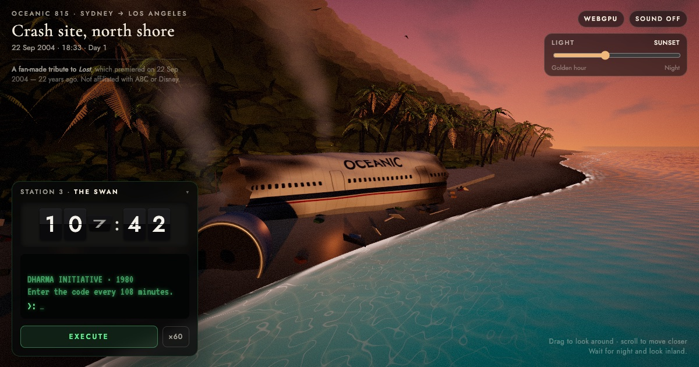

# LOST · Oceanic 815 Crash Beach

A fan-made tribute to *LOST*, which premiered on 22 September 2004. It shows the Flight 815 crash beach at sunset, built with [three.js](https://threejs.org) and WebGPU.

**▶ [Open the live scene](https://hilimor.github.io/lost-tribute/)**



## What's in it

- **The whole Island**, laid out after [Jonah Adkins' 2010 fan map](https://lostpedia.fandom.com/wiki/Fan_maps) (cross-checked with Choekaas's satellite-style map): the crash beach on the south coast, the Hatch just inland, the Black Rock and the Beechcraft in the middle, Taweret halfway up the west coast, the Temple in the north-west, the Barracks in the north, the Lighthouse on the south-east peninsula and Hydra Island to the east. The island is compressed to about 2 km so it can be explored.
- **An island map** (press **M**): click a numbered place to fly there. Each place links to the episode it's from:
  1. Crash site, south shore: the Oceanic 815 wreck, signal fire, camp
  2. The Hatch: the Swan station (its light comes on at night)
  3. The Beechcraft: wedged nose-down in the canopy
  4. The Black Rock: the slave ship stranded in the jungle
  5. The Statue of Taweret: the four-toed foot off the west coast
  6. The Temple: behind its high stone walls
  7. The Radio Tower: on the western plateau
  8. The Barracks: the DHARMA village and its sonic fence
  9. The Lighthouse: Jacob's tower on the east cliffs
  10. Hydra Island: the station and the bear cages
- Every place has its own link, e.g. [#black-rock](https://hilimor.github.io/lost-tribute/#black-rock) or [#statue](https://hilimor.github.io/lost-tribute/#statue)
- A shader-driven ocean with foam and shallows on every coast
- A light slider from golden hour to night: stars, moonlight, the lighthouse beams and the hatch light
- **The Swan:** a working 108-minute countdown. Type `4 8 15 16 23 42` and press Execute before it hits zero.
- Palms, crabs, seabirds, a campfire, and optional sound generated in the browser

Everything is procedural: no footage, images, models or audio from the show are used.

## Run it locally

The page uses JavaScript modules, so it needs a local web server; opening `index.html` by double-clicking won't work.

```sh
cd ~/lost-tribute
python3 -m http.server 8000
```

Then open <http://localhost:8000> in a recent Chrome, Edge or Safari. There's nothing to install or build: three.js loads from a CDN. Browsers without WebGPU fall back to WebGL 2.

## How the code is organised

```
index.html                 page structure: HUD, Swan panel, intro title
css/style.css              all styling
js/main.js                 entry point: renderer, camera, builds the island, frame loop
js/core/
  layout.js                where everything is: island outline, landmark positions, clearings
  terrain-math.js          ground height everywhere (used to place everything)
  camera-flight.js         smooth camera flights between places
  uniforms.js              shared shader values (sun, sky colours, time, discharge...)
  utils.js                 seeded random numbers and small helpers
js/environment/
  sky.js                   sky dome, clouds, stars, and sky light/reflections for all materials
  lights.js                sun/moon light, fill light, fog
  time-of-day.js           the light slider: blends 4 keyframes from golden hour to night
  post.js                  bloom, vignette, film grain
js/world/
  terrain.js               the ground: sand, jungle floor, seaweed tide line
  ocean.js                 waves, foam, shallows, reflections
  wreck.js                 fuselage, wing, engine, luggage, seats, camp
  fire.js                  campfire, embers, smoke
  vegetation.js            palms, coconuts, driftwood, jungle, rocks
  wildlife.js              seabirds and crabs
  hatch.js                 the hatch and its light beam
  landmarks/               Black Rock, Taweret statue, Temple, Barracks, Lighthouse,
                           Radio Tower, Hydra station, Beechcraft (one file each)
js/ui/
  places.js                the places on the map: camera views and story notes
  island-map.js            the island map window
  swan.js                  the 108-minute countdown
  audio.js                 generated sound
  intro.js                 LOST title card
```

One thing to know before editing: props are placed with a **seeded random sequence**, so the island looks the same on every visit. `main.js` builds the world in a fixed order; changing that order, or adding random calls in the middle, will shuffle where palms and debris end up.

## Credits

- [three.js](https://github.com/mrdoob/three.js) (MIT)
- Fonts from Google Fonts (SIL Open Font License): Cormorant Garamond, Jost, VT323 and Noto Sans Egyptian Hieroglyphs

---

*LOST* and related names are the property of ABC Studios and Disney. This is a non-commercial fan project and is not affiliated with or endorsed by them.
